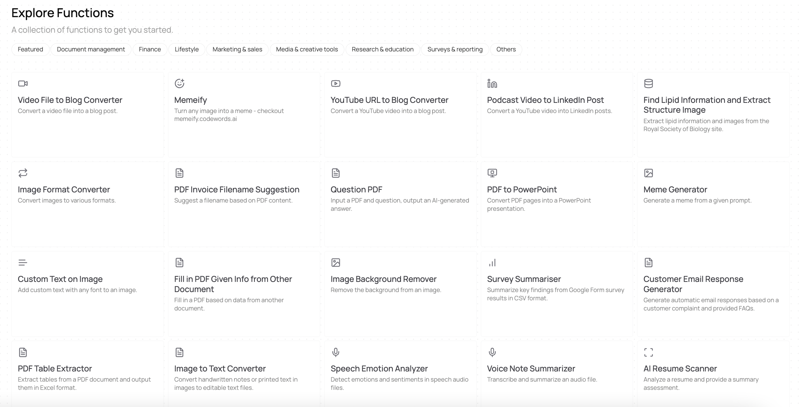

# Capabilities

Today, CodeWords is best suited for building back-end systems, complemented with a simple front-end.


:bulb:A back-end system is like the behind-the-scenes engine of a website or application that powers everything you see and do when you use it.

Imagine a restaurant: the front-end 🖥️ is what customers interact with—the menu, the tables, the ambiance—while the back-end ⚙️ is the kitchen where the chefs prepare the food.&#x20;

You don’t see the kitchen, but it’s where the most crucial work happens to make your dining experience possible.&#x20;

To make your dining experience even better, the restaurant can remember you by keeping a state 📀 of you as a customer. This is the concept of statefulness.


In other words, the CodeWords functions will:

* Take in set of inputs (as free text or uploadable files)
* Perform a computation using those inputs
* Give outputs (as free text or downloadable files)

We will be supporting more complex front-end experiences in the near future such that the end users of your application can have more customized interactions with your software.

| ‎          | Back-End                                   | State                                     | Front-End                |
| ---------- | ------------------------------------------ | ----------------------------------------- | ------------------------ |
| Q3-2024    | Microservices, Back-end deployed as an API | Yes, as part of a CodeWords function      | Simple, static front-end |
| Short-Term | Secrets and environment variables          | Multiple storage solutions to choose from | Dynamic                  |
| Mid-Term   | Streaming                                  | Stateful generation                       | Single Page Application  |
| Long-Term  | Automatic Updates                          |                                           | Generative UI            |

There are four main areas where CodeWords can currently effectively build functions:

<table data-card-size="large" data-view="cards"><thead><tr><th></th><th></th><th></th></tr></thead><tbody><tr><td> ⚙️ <strong>Data Processing</strong></td><td>Data processing functions deal with managing and modifying data, such as file conversions, data compression, merging, splitting, or restructuring (e.g., adding text to a video).</td><td>

<em>Current limitations to be aware of:</em>
<ul><li><em>Cannot modify content of PPT files</em></li><li><em>Cannot reliably process audio or video files >60 minutes long</em></li></ul></td></tr><tr><td>🖼️ <strong>Content Generation</strong></td><td></td><td></td></tr><tr><td>🗒️<strong>Information extraction</strong></td><td></td><td></td></tr><tr><td>📊 <strong>Computation &#x26; analysis</strong></td><td></td><td></td></tr></tbody></table>

### Explore Functions

Check out our Function Gallery to see what other people have built. Find it [here](https://app.codewords.ai/explore).

<figure><figcaption>
Run other users shared functions, or use the functions as a foundation for when you're building new ones.
</figcaption></figure>
