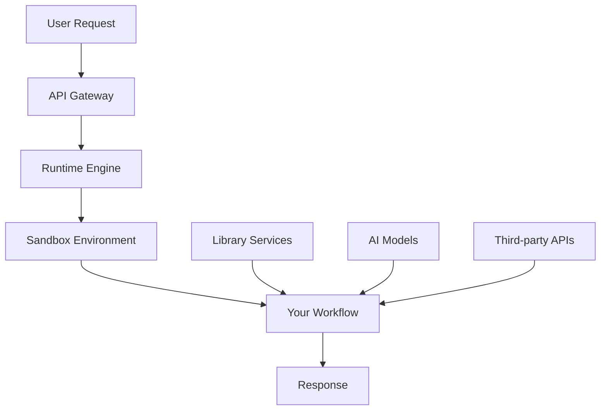

# CodeWords Builder DevX

## CodeWords Developer Experience (DevX) Documentation

### Table of Contents

1. Introduction
2. Quick Start & Setup
3. Understanding CodeWords
4. Development Tools & Features
5. Platform Components
6. Integration Capabilities
7. Example Use Cases
8. Best Practices
9. FAQ
10. Support & Resources

***

### Introduction

CodeWords is a serverless AI automation platform that enables developers to rapidly build, deploy, and scale intelligent workflows. With built-in AI models, 2000+ third-party integrations, and a powerful chrome extension, CodeWords transforms how you build automation solutions.

#### Why CodeWords?

* **⚡ Zero Infrastructure Setup** - Deploy workflows instantly without managing servers
* **🤖 AI-First Architecture** - Built-in access to OpenAI, Anthropic, and Gemini models
* **🔌 2000+ Integrations** - Connect to any service via Pipedream integrations
* **🛡️ Secure Sandboxing** - Each execution runs in an isolated environment
* **📊 Built-in Analytics** - Track performance, costs, and usage automatically

***

### Quick Start & Setup

#### Prerequisites

* Python 3.11+ knowledge
* FastAPI familiarity (helpful but not required)
* Chrome browser (for browser automation features)

#### Step 1: Get Your API Key

1. Sign up at [CodeWords Platform](https://codewords.agemo.ai)
2. Navigate to your dashboard and copy your API key
3. Store it securely - you'll need it for workflow execution

#### Step 2: Install Chrome Extension (Optional but Recommended)

1. Visit the Chrome Web Store and search for "CodeWords"
2. Click "Add to Chrome" to install the extension
3. The extension enables browser automation and data extraction capabilities

#### Step 3: Your First Workflow

Create your first workflow using one of these methods:

**Method A: Use a Template**

```bash
# Browse available templates
curl -X GET "https://api.codewords.agemo.ai/templates" \
  -H "Authorization: Bearer YOUR_API_KEY"

# Deploy a template
curl -X POST "https://api.codewords.agemo.ai/deploy" \
  -H "Authorization: Bearer YOUR_API_KEY" \
  -H "Content-Type: application/json" \
  -d '{"template_id": "person_finder"}'
```

**Method B: Write Custom Code**

```python
# /// script
# requires-python = "==3.11.*"
# dependencies = [
#   "fastapi==0.115.12",
#   "uvicorn[standard]==0.34.2",
#   "pydantic==2.11.3",
#   "structlog==25.2.0",
#   "httpx==0.25.0",
#   "codewords-client==0.2.4"
# ]
# [tool.env-checker]
# env_vars = [
#   "PORT=8000",
#   "LOGLEVEL=INFO",
#   "CODEWORDS_API_KEY",
#   "CODEWORDS_RUNTIME_URI"
# ]
# ///

import logging
import os
from fastapi import FastAPI
from pydantic import BaseModel

logging.basicConfig(level=os.environ.get("LOGLEVEL", "INFO"))

app = FastAPI(title="My First CodeWords Workflow")

class GreetingRequest(BaseModel):
    name: str

class GreetingResponse(BaseModel):
    message: str

@app.post("/", response_model=GreetingResponse)
async def greet(request: GreetingRequest):
    return GreetingResponse(message=f"Hello {request.name}!")

if __name__ == "__main__":
    import uvicorn
    uvicorn.run(app, host="0.0.0.0", port=int(os.environ.get("PORT", 8000)))
```

#### Step 4: Deploy Your Workflow

```python
# Save your workflow and deploy
from codewords_client import CodewordsClient

client = CodewordsClient(api_key="your_api_key")
result = client.deploy_workflow(
    code=workflow_code,
    name="My First Workflow"
)
print(f"Deployed! URL: {result.url}")
```

***

### Understanding CodeWords

#### Core Architecture

CodeWords is built on a **microservices architecture** where each workflow is a standalone FastAPI application that runs in secure, isolated sandboxes.



#### Key Concepts

**1. Workflows**

* **FastAPI applications** that define your automation logic
* **Stateless** - each execution is independent
* **Scalable** - automatically handle concurrent requests
* **Versioned** - maintain multiple versions of your workflows

**2. Sandboxes**

* **Isolated environments** powered by E2B technology
* **Ephemeral** - created on-demand, destroyed after execution
* **Secure** - no access to other users' data or workflows
* **Resource-limited** - automatic cleanup and timeout protection

**3. Library Services**

Pre-built services that handle common tasks:

* **AI Models** - OpenAI, Anthropic, Gemini
* **Web Automation** - Chrome extension, web agents
* **Data Sources** - Reddit, GitHub, search engines
* **Communication** - Slack, WhatsApp, email
* **Storage** - File upload/download, state management

***

### Development Tools & Features

#### 1. Workflow Development Tools

**CodeWords Client SDK**

```python
from codewords_client import AsyncCodewordsClient

# Call other CodeWords services
async with AsyncCodewordsClient() as client:
    result = await client.run(
        service_id="github",
        path="/search_profiles",
        data={"query": "python developers"}
    )
```

**Built-in Validation**

```python
# Validate your workflow before deployment
result = client.validate_workflow(workflow_code)
if not result.all_passed:
    print(f"Validation errors: {result.report}")
```

**Live Monitoring**

```python
# Monitor workflow execution
logs = client.get_workflow_logs(request_id)
output = client.get_workflow_output(request_id)
```

#### 2. AI Integration Tools

**Structured Output Generation**

```python
from openai import AsyncOpenAI
from pydantic import BaseModel

class PersonProfile(BaseModel):
    name: str
    job_title: str
    company: str
    skills: List[str]

async def analyze_profile(text: str) -> PersonProfile:
    client = AsyncOpenAI(
        api_key=os.environ["CODEWORDS_API_KEY"],
        base_url=f"{os.environ['CODEWORDS_RUNTIME_URI']}/openai"
    )
    
    response = await client.beta.chat.completions.parse(
        model="gpt-4o-mini",
        messages=[{"role": "user", "content": text}],
        response_format=PersonProfile
    )
    return response.choices[0].message.parsed
```

**Multi-Model Support**

```python
# Use different models for different tasks
gemini_client = get_gemini_client()  # For large context
claude_client = get_anthropic_client()  # For analysis
openai_client = get_openai_client()  # For structured output
```

#### 3. Web Automation Tools

**Chrome Extension Integration**

```python
from codewords_client import AsyncCodewordsClient

async def scrape_linkedin_profile(url: str):
    async with AsyncCodewordsClient() as client:
        result = await client.run(
            service_id="chrome_extension",
            path="/actions",
            data={
                "actions": [
                    {"type": "navigate", "url": url},
                    {"type": "wait", "time": 3},
                    {"type": "extract", "selector": ".pv-text-details__left-panel"}
                ]
            }
        )
    return result
```

**Web Agent for Complex Tasks**

```python
async def automate_complex_task(instructions: str):
    async with AsyncCodewordsClient() as client:
        result = await client.run(
            service_id="web_automation_agent",
            data={
                "url": "https://example.com",
                "instructions": instructions,
                "max_steps": 10
            }
        )
    return result
```

#### 4. Secret Management

```python
# Set up secrets for integrations
client.manage_secrets(
    operation="add",
    secret_name="OPENAI_API_KEY",
    secret_value="sk-..."
)

# Use in workflow
api_key = os.environ.get("OPENAI_API_KEY")
```

***

### Platform Components

#### 1. Runtime Engine

* **Request routing** and authentication
* **Sandbox provisioning** and lifecycle management
* **Dependency installation** using `uv`
* **Log streaming** and error handling
* **Usage tracking** and billing

#### 2. Library Services

**AI Services**

* **OpenAI GPT** (`openai`) - Text generation, embeddings, vision
* **Anthropic Claude** (`anthropic`) - Reasoning, analysis, tool use
* **Google Gemini** (`gemini`) - Large context, multimodal

**Web Automation**

* **Chrome Extension** (`chrome_extension`) - Browser automation
* **Web Agent** (`web_automation_agent`) - AI-powered web tasks
* **Webpage to Markdown** (`webpage_to_markdown`) - Content extraction

**Data Sources**

* **GitHub** (`github`) - Repository and profile search
* **Reddit** (`reddit`) - Post and comment retrieval
* **Search API** (`searchapi`) - Google, Bing, YouTube search
* **Hunter.io** (`hunter`) - Email finding

**Communication**

* **Slack Trigger** (`slack_trigger`) - Slack bot integration
* **WhatsApp Trigger** (`whatsapp_trigger`) - WhatsApp automation
* **Send Email** (`send_email`) - Email delivery

**Utilities**

* **Schedule Runs** (`schedule_runs`) - Workflow scheduling
* **User Login** (`user_login`) - Authentication management
* **Firecrawl** (`firecrawl`) - Web scraping

#### 3. Pipedream Integrations

Access 2000+ third-party services:

**Popular Categories**

* **CRM**: Salesforce, HubSpot, Pipedrive
* **Email**: Gmail, Outlook, Mailchimp
* **Calendar**: Google Calendar, Outlook Calendar
* **Social**: LinkedIn, Twitter, Facebook
* **Storage**: Google Drive, Dropbox, OneDrive
* **Payment**: Stripe, PayPal, Square
* **Database**: MySQL, PostgreSQL, MongoDB

**Usage Pattern**

```python
async def use_pipedream_integration():
    async with AsyncCodewordsClient() as client:
        result = await client.run(
            service_id="pipedream",
            data={
                "app_slug": "hubspot",
                "action_name": "create-contact",
                "props": {
                    "email": "user@example.com",
                    "firstName": "John",
                    "lastName": "Doe"
                }
            }
        )
    return result
```

***

### Integration Capabilities

#### 1. Authentication Management

**OAuth Integration**

```python
# Check authentication status
auth_status = client.discover_pipedream_integrations(
    operation="check_auth",
    app_slug="google_calendar"
)

if not auth_status.connected:
    print(f"Please authenticate: {auth_status.connect_link_url}")
```

**API Key Management**

```python
# Store API keys securely
client.manage_secrets(
    operation="add",
    secret_name="STRIPE_API_KEY",
    secret_value="sk_test_..."
)

# Use in environment variables
# [tool.env-checker]
# env_vars = ["STRIPE_API_KEY"]
```

#### 2. Data Integration Patterns

**Google Sheets**

```python
async def update_sheet(sheet_id: str, data: List[List[str]]):
    # Read existing data
    existing_data = await read_data_from_sheet(sheet_id, "A:Z")
    
    # Update with new data
    updates = [{"range": "A1:Z100", "values": data}]
    await update_sheet_batch(sheet_id, updates)
```

**Airtable**

```python
async def sync_airtable(base_id: str, table_name: str):
    # Read records
    records = await read_airtable_records(base_id, table_name)
    
    # Process and update
    updates = []
    for record in records:
        updated_fields = process_record(record)
        updates.append({
            "id": record["id"],
            "fields": updated_fields
        })
    
    await update_airtable_records(base_id, table_name, updates)
```

#### 3. Workflow Scheduling

```python
async def setup_monitoring():
    async with AsyncCodewordsClient() as client:
        # Schedule workflow to run every hour
        await client.run(
            service_id="schedule_runs",
            data={
                "service_id": "website_monitor",
                "cron_expression": "0 * * * *",  # Every hour
                "input_data": {"url": "https://example.com"}
            }
        )
```

***

### Example Use Cases

#### Example 1: LinkedIn Profile Enricher

**Scenario**: Automatically enrich a list of LinkedIn URLs with structured profile data.

**Implementation**:

```python
# /// script
# requires-python = "==3.11.*"
# dependencies = [
#   "fastapi==0.115.12",
#   "uvicorn[standard]==0.34.2",
#   "pydantic==2.11.3",
#   "structlog==25.2.0",
#   "codewords-client==0.2.4"
# ]
# [tool.env-checker]
# env_vars = [
#   "PORT=8000",
#   "LOGLEVEL=INFO", 
#   "CODEWORDS_API_KEY",
#   "CODEWORDS_RUNTIME_URI"
# ]
# ///

import asyncio
import logging
from typing import List, Optional
from fastapi import FastAPI, HTTPException
from pydantic import BaseModel, HttpUrl
from codewords_client import AsyncCodewordsClient
import structlog

logger = structlog.get_logger()

app = FastAPI(
    title="LinkedIn Profile Enricher",
    description="Enrich LinkedIn profile URLs with structured data"
)

class ProfileData(BaseModel):
    name: str
    headline: Optional[str] = None
    company: Optional[str] = None
    location: Optional[str] = None
    experience: List[str] = []
    education: List[str] = []

class EnrichmentRequest(BaseModel):
    linkedin_urls: List[HttpUrl]
    max_concurrent: int = 5

class EnrichmentResponse(BaseModel):
    profiles: List[ProfileData]
    success_count: int
    error_count: int

@app.post("/", response_model=EnrichmentResponse)
async def enrich_profiles(request: EnrichmentRequest):
    """Enrich LinkedIn profiles with structured data."""
    logger.info("Starting profile enrichment", 
                url_count=len(request.linkedin_urls))
    
    semaphore = asyncio.Semaphore(request.max_concurrent)
    profiles = []
    errors = 0
    
    async def enrich_single_profile(url: str) -> Optional[ProfileData]:
        async with semaphore:
            try:
                # Use Chrome extension to scrape profile
                async with AsyncCodewordsClient() as client:
                    # Navigate to profile
                    result = await client.run(
                        service_id="chrome_extension",
                        path="/actions",
                        data={
                            "actions": [
                                {"type": "navigate", "url": str(url)},
                                {"type": "wait", "time": 3},
                                {"type": "extract_html"}
                            ]
                        }
                    )
                    
                    if not result.get("success"):
                        logger.error("Failed to extract profile", url=url)
                        return None
                    
                    html_content = result["data"]["html"]
                    
                    # Use AI to extract structured data
                    ai_result = await client.run(
                        service_id="openai",
                        data={
                            "model": "gpt-4o-mini",
                            "prompt": f"Extract profile data from this HTML: {html_content}",
                            "example_output": ProfileData.model_json_schema()
                        }
                    )
                    
                    return ProfileData(**ai_result["response"])
                    
            except Exception as e:
                logger.error("Error enriching profile", url=url, error=str(e))
                return None
    
    # Process all URLs concurrently
    tasks = [enrich_single_profile(url) for url in request.linkedin_urls]
    results = await asyncio.gather(*tasks, return_exceptions=True)
    
    for result in results:
        if isinstance(result, ProfileData):
            profiles.append(result)
        else:
            errors += 1
    
    logger.info("Enrichment completed", 
                success_count=len(profiles), 
                error_count=errors)
    
    return EnrichmentResponse(
        profiles=profiles,
        success_count=len(profiles),
        error_count=errors
    )

if __name__ == "__main__":
    import uvicorn
    uvicorn.run(app, host="0.0.0.0", port=int(os.environ.get("PORT", 8000)))
```

**Usage**:

```bash
curl -X POST "https://your-workflow-url/" \
  -H "Content-Type: application/json" \
  -d '{
    "linkedin_urls": [
      "https://linkedin.com/in/johndoe",
      "https://linkedin.com/in/janedoe"
    ],
    "max_concurrent": 3
  }'
```

#### Example 2: Competitor Website Monitor

**Scenario**: Monitor competitor websites for changes and send Slack alerts.

**Implementation**:

```python
# /// script
# requires-python = "==3.11.*"
# dependencies = [
#   "fastapi==0.115.12",
#   "uvicorn[standard]==0.34.2", 
#   "pydantic==2.11.3",
#   "structlog==25.2.0",
#   "codewords-client==0.2.4",
#   "slack-sdk==3.31.0"
# ]
# [tool.env-checker]
# env_vars = [
#   "PORT=8000",
#   "LOGLEVEL=INFO",
#   "CODEWORDS_API_KEY",
#   "CODEWORDS_RUNTIME_URI",
#   "SLACK_BOT_TOKEN",
#   "PIPEDREAM_SLACK_ACCESS"
# ]
# ///

import os
from typing import Optional, Dict, Any
from fastapi import FastAPI
from pydantic import BaseModel, HttpUrl
from codewords_client import AsyncCodewordsClient
import structlog

logger = structlog.get_logger()

app = FastAPI(
    title="Website Monitor",
    description="Monitor websites for changes and send alerts"
)

class MonitorRequest(BaseModel):
    url: HttpUrl
    slack_channel: str
    check_frequency: str = "0 9 * * *"  # Daily at 9 AM
    comparison_prompt: str = "Identify significant changes in content, pricing, or features"

class MonitorResponse(BaseModel):
    message: str
    changes_detected: bool
    summary: Optional[str] = None

@app.post("/", response_model=MonitorResponse)
async def monitor_website(request: MonitorRequest):
    """Monitor a website for changes and send alerts."""
    logger.info("Starting website monitoring", url=request.url)
    
    async with AsyncCodewordsClient() as client:
        # Get current website content
        current_content = await client.run(
            service_id="firecrawl",
            data={
                "url": str(request.url),
                "formats": ["markdown"],
                "onlyMainContent": True
            }
        )
        
        if not current_content.get("success"):
            logger.error("Failed to fetch website content")
            return MonitorResponse(
                message="Failed to fetch website content",
                changes_detected=False
            )
        
        current_markdown = current_content["data"]["markdown"]
        
        # Get previous snapshot from Redis
        snapshot_key = f"website_snapshot_{hash(str(request.url))}"
        
        redis_result = await client.run(
            service_id="redis_coordinator",
            data={
                "action": "get",
                "key": snapshot_key
            }
        )
        
        previous_content = redis_result.get("value") if redis_result.get("success") else None
        
        if not previous_content:
            # First run - store snapshot
            await client.run(
                service_id="redis_coordinator",
                data={
                    "action": "set",
                    "key": snapshot_key,
                    "value": current_markdown,
                    "ttl": 30 * 24 * 3600  # 30 days
                }
            )
            
            logger.info("Stored initial snapshot")
            return MonitorResponse(
                message="Initial snapshot stored. Monitoring will begin on next run.",
                changes_detected=False
            )
        
        # Compare content using AI
        comparison_result = await client.run(
            service_id="anthropic",
            data={
                "model": "claude-3-5-haiku-20241022",
                "prompt": f"""
                Compare these two versions of a website and {request.comparison_prompt}.
                
                Previous version:
                {previous_content}
                
                Current version:
                {current_markdown}
                
                Respond with a JSON object containing:
                - changes_detected: boolean
                - summary: string (if changes detected)
                """,
                "example_output": {
                    "changes_detected": True,
                    "summary": "Pricing increased from $99 to $129 for premium plan"
                }
            }
        )
        
        analysis = comparison_result.get("response", {})
        changes_detected = analysis.get("changes_detected", False)
        
        if changes_detected:
            summary = analysis.get("summary", "Changes detected")
            
            # Send Slack notification
            await client.run(
                service_id="pipedream",
                data={
                    "app_slug": "slack",
                    "action_name": "send-message",
                    "props": {
                        "channel": request.slack_channel,
                        "text": f"🚨 Website Change Detected!\n\n**URL**: {request.url}\n**Summary**: {summary}"
                    }
                }
            )
            
            # Update snapshot
            await client.run(
                service_id="redis_coordinator", 
                data={
                    "action": "set",
                    "key": snapshot_key,
                    "value": current_markdown,
                    "ttl": 30 * 24 * 3600
                }
            )
            
            logger.info("Changes detected and notification sent", summary=summary)
            
            return MonitorResponse(
                message="Changes detected and notification sent",
                changes_detected=True,
                summary=summary
            )
        else:
            logger.info("No significant changes detected")
            return MonitorResponse(
                message="No significant changes detected",
                changes_detected=False
            )

if __name__ == "__main__":
    import uvicorn
    uvicorn.run(app, host="0.0.0.0", port=int(os.environ.get("PORT", 8000)))
```

#### Example 3: AI-Powered Customer Support Ticket Analyzer

**Scenario**: Analyze support tickets, categorize them, and route to appropriate teams.

**Implementation**:

```python
# /// script
# requires-python = "==3.11.*"
# dependencies = [
#   "fastapi==0.115.12",
#   "uvicorn[standard]==0.34.2",
#   "pydantic==2.11.3", 
#   "structlog==25.2.0",
#   "codewords-client==0.2.4"
# ]
# [tool.env-checker]
# env_vars = [
#   "PORT=8000",
#   "LOGLEVEL=INFO",
#   "CODEWORDS_API_KEY", 
#   "CODEWORDS_RUNTIME_URI",
#   "PIPEDREAM_HUBSPOT_ACCESS"
# ]
# ///

from enum import Enum
from typing import List, Optional
from fastapi import FastAPI
from pydantic import BaseModel, Field
from codewords_client import AsyncCodewordsClient
import structlog

logger = structlog.get_logger()

app = FastAPI(
    title="Support Ticket Analyzer",
    description="AI-powered support ticket analysis and routing"
)

class Priority(str, Enum):
    LOW = "low"
    MEDIUM = "medium"
    HIGH = "high"
    URGENT = "urgent"

class Category(str, Enum):
    BILLING = "billing"
    TECHNICAL = "technical"
    FEATURE_REQUEST = "feature_request"
    BUG_REPORT = "bug_report"
    GENERAL = "general"

class Sentiment(str, Enum):
    POSITIVE = "positive"
    NEUTRAL = "neutral"
    NEGATIVE = "negative"

class TicketAnalysis(BaseModel):
    category: Category
    priority: Priority
    sentiment: Sentiment
    summary: str = Field(description="Brief summary of the ticket")
    suggested_response: str = Field(description="Suggested response template")
    action_items: List[str] = Field(description="Specific action items")
    escalation_needed: bool = Field(description="Whether escalation is needed")

class AnalyzeTicketRequest(BaseModel):
    ticket_id: str
    subject: str
    content: str
    customer_email: str
    customer_tier: str = "standard"  # standard, premium, enterprise

class AnalyzeTicketResponse(BaseModel):
    ticket_id: str
    analysis: TicketAnalysis
    routing_team: str
    estimated_resolution_time: str

@app.post("/", response_model=AnalyzeTicketResponse)
async def analyze_ticket(request: AnalyzeTicketRequest):
    """Analyze a support ticket and provide routing recommendations."""
    logger.info("Analyzing ticket", ticket_id=request.ticket_id)
    
    async with AsyncCodewordsClient() as client:
        # Analyze ticket using AI
        analysis_result = await client.run(
            service_id="openai",
            data={
                "model": "gpt-4o",
                "prompt": f"""
                Analyze this customer support ticket and provide detailed analysis:
                
                Customer Tier: {request.customer_tier}
                Subject: {request.subject}
                Content: {request.content}
                
                Consider:
                - Urgency indicators (downtime, revenue impact, security)
                - Customer tier (enterprise customers get higher priority)
                - Technical complexity
                - Sentiment and frustration level
                """,
                "example_output": TicketAnalysis.model_json_schema()
            }
        )
        
        analysis = TicketAnalysis(**analysis_result["response"])
        
        # Determine routing team
        routing_team = determine_routing_team(analysis.category, analysis.priority, request.customer_tier)
        
        # Estimate resolution time
        resolution_time = estimate_resolution_time(analysis.category, analysis.priority, request.customer_tier)
        
        # Update CRM with analysis
        await update_crm_ticket(
            client,
            request.ticket_id,
            request.customer_email,
            analysis,
            routing_team
        )
        
        logger.info("Ticket analysis completed", 
                   ticket_id=request.ticket_id,
                   category=analysis.category,
                   priority=analysis.priority,
                   team=routing_team)
        
        return AnalyzeTicketResponse(
            ticket_id=request.ticket_id,
            analysis=analysis,
            routing_team=routing_team,
            estimated_resolution_time=resolution_time
        )

def determine_routing_team(category: Category, priority: Priority, customer_tier: str) -> str:
    """Determine which team should handle the ticket."""
    if category == Category.BILLING:
        return "billing_team"
    elif category == Category.TECHNICAL and priority in [Priority.HIGH, Priority.URGENT]:
        return "senior_technical_team"
    elif category == Category.TECHNICAL:
        return "technical_team"
    elif category == Category.BUG_REPORT:
        return "engineering_team"
    elif category == Category.FEATURE_REQUEST:
        return "product_team"
    else:
        return "general_support_team"

def estimate_resolution_time(category: Category, priority: Priority, customer_tier: str) -> str:
    """Estimate resolution time based on ticket characteristics."""
    base_times = {
        Priority.URGENT: "2-4 hours",
        Priority.HIGH: "4-8 hours", 
        Priority.MEDIUM: "1-2 days",
        Priority.LOW: "3-5 days"
    }
    
    # Enterprise customers get faster resolution
    if customer_tier == "enterprise":
        enterprise_times = {
            Priority.URGENT: "1-2 hours",
            Priority.HIGH: "2-4 hours",
            Priority.MEDIUM: "4-8 hours", 
            Priority.LOW: "1-2 days"
        }
        return enterprise_times.get(priority, base_times[priority])
    
    return base_times.get(priority, "3-5 days")

async def update_crm_ticket(
    client: AsyncCodewordsClient,
    ticket_id: str,
    customer_email: str,
    analysis: TicketAnalysis,
    routing_team: str
):
    """Update CRM system with ticket analysis."""
    try:
        await client.run(
            service_id="pipedream",
            data={
                "app_slug": "hubspot",
                "action_name": "update-ticket",
                "props": {
                    "ticket_id": ticket_id,
                    "properties": {
                        "hs_ticket_category": analysis.category,
                        "hs_ticket_priority": analysis.priority,
                        "sentiment": analysis.sentiment,
                        "routing_team": routing_team,
                        "ai_summary": analysis.summary,
                        "escalation_needed": analysis.escalation_needed
                    }
                }
            }
        )
        logger.info("CRM updated successfully", ticket_id=ticket_id)
    except Exception as e:
        logger.error("Failed to update CRM", ticket_id=ticket_id, error=str(e))

if __name__ == "__main__":
    import uvicorn
    uvicorn.run(app, host="0.0.0.0", port=int(os.environ.get("PORT", 8000)))
```

***

### Best Practices

#### 1. Workflow Design

**Structure Your Code Properly**

```python
# ✅ Good: Clear separation of concerns
class DataProcessor:
    async def process(self, data: List[Dict]) -> List[Dict]:
        cleaned = await self.clean_data(data)
        enriched = await self.enrich_data(cleaned)
        return await self.validate_results(enriched)

# ❌ Bad: Everything in one function
@app.post("/")
async def process_everything(request):
    # 200 lines of mixed logic...
```

**Use Proper Error Handling**

```python
# ✅ Good: Specific error handling
try:
    result = await external_api_call()
except httpx.HTTPStatusError as e:
    if e.response.status_code == 429:
        # Handle rate limiting
        await asyncio.sleep(retry_delay)
        result = await external_api_call()
    else:
        raise HTTPException(status_code=502, detail="External API error")
except httpx.TimeoutException:
    raise HTTPException(status_code=504, detail="Request timeout")

# ❌ Bad: Generic exception handling
try:
    result = await external_api_call()
except Exception:
    return {"error": "Something went wrong"}
```

**Implement Proper Logging**

```python
# ✅ Good: Structured logging with context
logger.info("Processing batch", 
           batch_size=len(items),
           user_id=user_id,
           operation="data_enrichment")

# ❌ Bad: Basic print statements
print(f"Processing {len(items)} items")
```

#### 2. Performance Optimization

**Use Concurrency Wisely**

```python
# ✅ Good: Controlled concurrency
semaphore = asyncio.Semaphore(5)  # Limit to 5 concurrent operations

async def process_item(item):
    async with semaphore:
        return await expensive_operation(item)

# Process items concurrently
tasks = [process_item(item) for item in items]
results = await asyncio.gather(*tasks, return_exceptions=True)
```

**Optimize API Calls**

```python
# ✅ Good: Batch operations
batch_size = 10
for i in range(0, len(items), batch_size):
    batch = items[i:i + batch_size]
    await process_batch(batch)

# ❌ Bad: One item at a time
for item in items:
    await process_single_item(item)
```

#### 3. Security Best Practices

**Use Environment Variables for Secrets**

```python
# ✅ Good: Environment variables
api_key = os.environ["THIRD_PARTY_API_KEY"]

# ❌ Bad: Hardcoded secrets  
api_key = "sk-1234567890abcdef"  # Never do this!
```

**Validate Input Thoroughly**

```python
# ✅ Good: Comprehensive validation
class EmailRequest(BaseModel):
    email: EmailStr = Field(..., description="Valid email address")
    name: str = Field(..., min_length=1, max_length=100)
    age: int = Field(..., ge=0, le=120)

# ❌ Bad: No validation
class EmailRequest(BaseModel):
    email: str
    name: str
    age: int
```

#### 4. Cost Optimization

**Choose the Right AI Model**

```python
# ✅ Good: Model selection based on task
def get_model_for_task(task_type: str) -> str:
    if task_type == "simple_extraction":
        return "gpt-4o-mini"  # Cheaper for simple tasks
    elif task_type == "complex_reasoning":
        return "gpt-4o"  # More capable for complex tasks
    elif task_type == "large_context":
        return "gemini-1.5-pro"  # Best for large inputs
```

**Cache Expensive Operations**

```python
# ✅ Good: Caching with Redis
async def get_cached_result(key: str):
    cached = await redis_client.get(key)
    if cached:
        return json.loads(cached)
    
    result = await expensive_computation()
    await redis_client.setex(key, 3600, json.dumps(result))  # 1 hour cache
    return result
```

***

### FAQ

#### General Questions

**Q: What is CodeWords and how does it work?**

**A:** CodeWords is a serverless automation platform that runs your Python workflows in secure, isolated sandboxes. You write FastAPI applications that can access AI models, third-party APIs, and automation tools. Each workflow runs on-demand without requiring server management.

**Q: Do I need to know specific frameworks to use CodeWords?**

**A:** Basic Python knowledge is required. Familiarity with FastAPI and Pydantic is helpful but not essential - the platform provides templates and examples to get you started quickly.

**Q: How much does CodeWords cost?**

**A:** CodeWords uses a pay-per-use model. You're charged for compute time, AI model usage, third-party API calls, and storage. There's a generous free tier to get started.

#### Development Questions

**Q: Can I use any Python package in my workflows?**

**A:** You can use most Python packages available on PyPI. Declare them in your workflow's PEP 723 header and they'll be automatically installed. Some packages with complex system dependencies might not be available.

**Q: How do I debug my workflows?**

**A:** Several debugging options:

* Use structured logging with `structlog`
* Stream logs in real-time during development
* Access detailed error traces
* Test locally before deployment
* Use the validation tool to catch issues early

**Q: Can workflows communicate with each other?**

**A:** Yes! Use the CodeWords client to call other workflows:

```python
async with AsyncCodewordsClient() as client:
    result = await client.run(
        service_id="other_workflow_id",
        data={"param": "value"}
    )
```

#### Integration Questions

**Q: How do I integrate with Google Sheets/Airtable?**

**A:** Use the native integration patterns:

* Google Sheets: OAuth token + Google Sheets API
* Airtable: API key + pyairtable library
* Both support batch operations for efficiency

**Q: What's the difference between Chrome Extension and Web Agent?**

**A:**

* **Chrome Extension**: Fast, simple browser automation. Good for data extraction and simple interactions.
* **Web Agent**: AI-powered automation for complex multi-step tasks. Handles dynamic content and complex workflows.

#### Security & Privacy Questions

**Q: How secure is my data in CodeWords?**

**A:** Security features include:

* Isolated sandbox execution (E2B)
* Encrypted secret storage
* No persistent storage between executions
* SOC 2 compliance (in progress)
* API key authentication

**Q: Can other users see my workflows or data?**

**A:** No. All workflows and data are private by default. You can optionally make workflows public as templates, but execution data remains private.

#### Performance Questions

**Q: What are the execution limits?**

**A:** Current limits:

* Maximum execution time: 15 minutes
* Memory limit: 2GB
* Storage: 10GB temporary
* Concurrent executions: 100 per user
* Rate limits vary by service

**Q: How can I optimize workflow performance?**

**A:** Best practices:

* Use concurrency with semaphores
* Batch API calls when possible
* Choose appropriate AI models for tasks
* Cache expensive computations
* Minimize data transfer

***

### Support & Resources

#### Documentation & Learning

* **Official Documentation**: [docs.codewords.agemo.ai](https://docs.codewords.agemo.ai)
* **API Reference**: [api.codewords.agemo.ai/docs](https://api.codewords.agemo.ai/docs)
* **Video Tutorials**: YouTube channel with step-by-step guides
* **Blog**: Technical articles and use case studies

#### Community & Support

* **Discord Community**: Join developers building with CodeWords
* **GitHub Examples**: Open-source workflow examples
* **Office Hours**: Weekly Q\&A sessions with the team
* **Support Email**: support@codewords.agemo.ai

#### Development Tools

* **Chrome Extension**: Essential for browser automation
* **CLI Tool**: Coming soon for local development
* **VS Code Extension**: Syntax highlighting and debugging
* **Postman Collection**: API testing and exploration

#### Quick Links

* 🚀 **Platform**: [codewords.agemo.ai](https://codewords.agemo.ai)
* 📚 **Templates**: Browse 30+ ready-to-use workflows
* 🛠️ **API Explorer**: Test library services interactively
* 📊 **Dashboard**: Monitor usage and performance
* 💬 **Community**: [Discord](https://discord.gg/codewords)

***

_Ready to start building? Sign up at_ [_codewords.agemo.ai_](https://codewords.agemo.ai) _and deploy your first workflow in minutes!_
