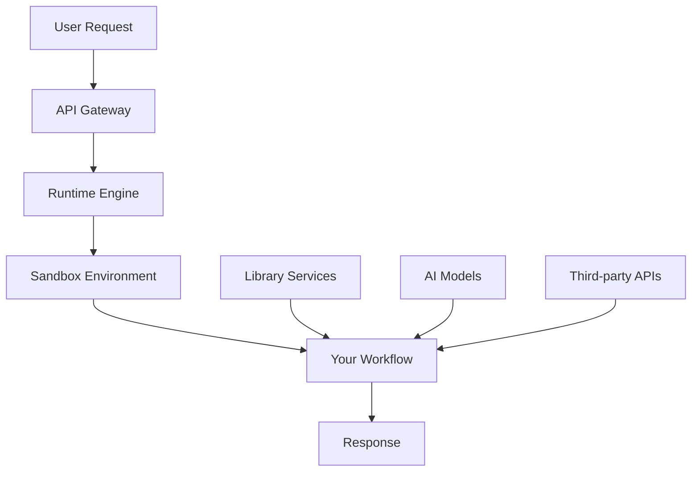

# Understanding CodeWords

#### Core Architecture

CodeWords is built on a **microservices architecture** where each workflow is a standalone FastAPI application that runs in secure, isolated sandboxes.



#### Key Concepts

**1. Workflows**

* **FastAPI applications** that define your automation logic
* **Stateless** - each execution is independent
* **Scalable** - automatically handle concurrent requests
* **Versioned** - maintain multiple versions of your workflows

**2. Sandboxes**

* **Isolated environments** powered by E2B technology
* **Ephemeral** - created on-demand, destroyed after execution
* **Secure** - no access to other users' data or workflows
* **Resource-limited** - automatic cleanup and timeout protection

**3. Library Services**

Pre-built services that handle common tasks:

* **AI Models** - OpenAI, Anthropic, Gemini
* **Web Automation** - Chrome extension, web agents
* **Data Sources** - Reddit, GitHub, search engines
* **Communication** - Slack, WhatsApp, email
* **Storage** - File upload/download, state management

***

### Platform Components

#### 1. Runtime Engine

* **Request routing** and authentication
* **Sandbox provisioning** and lifecycle management
* **Dependency installation** using `uv`
* **Log streaming** and error handling
* **Usage tracking** and billing

#### 2. Library Services

**AI Services**

* **OpenAI GPT** (`openai`) - Text generation, embeddings, vision
* **Anthropic Claude** (`anthropic`) - Reasoning, analysis, tool use
* **Google Gemini** (`gemini`) - Large context, multimodal

**Web Automation**

* **Chrome Extension** (`chrome_extension`) - Browser automation
* **Web Agent** (`web_automation_agent`) - AI-powered web tasks
* **Webpage to Markdown** (`webpage_to_markdown`) - Content extraction

**Data Sources**

* **GitHub** (`github`) - Repository and profile search
* **Reddit** (`reddit`) - Post and comment retrieval
* **Search API** (`searchapi`) - Google, Bing, YouTube search
* **Hunter.io** (`hunter`) - Email finding

**Communication**

* **Slack Trigger** (`slack_trigger`) - Slack bot integration
* **WhatsApp Trigger** (`whatsapp_trigger`) - WhatsApp automation
* **Send Email** (`send_email`) - Email delivery

**Utilities**

* **Schedule Runs** (`schedule_runs`) - Workflow scheduling
* **User Login** (`user_login`) - Authentication management
* **Firecrawl** (`firecrawl`) - Web scraping

#### 3. Pipedream Integrations

Access 2000+ third-party services:

**Popular Categories**

* **CRM**: Salesforce, HubSpot, Pipedrive
* **Email**: Gmail, Outlook, Mailchimp
* **Calendar**: Google Calendar, Outlook Calendar
* **Social**: LinkedIn, Twitter, Facebook
* **Storage**: Google Drive, Dropbox, OneDrive
* **Payment**: Stripe, PayPal, Square
* **Database**: MySQL, PostgreSQL, MongoDB


***

### Integration Capabilities

CodeWords provides access to over **2,000+ third-party integrations** through Pipedream, enabling you to connect with virtually any tool in your tech stack:

**Popular Categories:**

* **CRM & Sales**: Salesforce, HubSpot, Pipedrive, Airtable, Monday.com
* **Communication**: Slack, Discord, Microsoft Teams, Zoom, WhatsApp
* **Email & Marketing**: Gmail, Outlook, Mailchimp, SendGrid, Constant Contact
* **Data & Analytics**: Google Sheets, Notion, Zapier, Snowflake, BigQuery
* **E-commerce**: Shopify, WooCommerce, Stripe, PayPal, Square
* **Social Media**: LinkedIn, Twitter, Facebook, Instagram, YouTube
* **Project Management**: Asana, Trello, Jira, Linear, ClickUp
* **Cloud Storage**: Google Drive, Dropbox, OneDrive, Box, AWS S3
* **Databases**: MySQL, PostgreSQL, MongoDB, Redis, Supabase
* **Developer Tools**: GitHub, GitLab, Docker, Jenkins, Vercel

**What This Means for You:**

* **No Integration Limits**: Access enterprise-grade APIs without worrying about rate limits or complex authentication
* **Unified Interface**: Use the same simple CodeWords syntax across all 2000+ services
* **OAuth Handled**: We manage authentication flows, tokens, and refreshes automatically
* **Enterprise Ready**: Connect to internal tools, databases, and custom APIs seamlessly

Whether you're building a simple automation or a complex multi-system workflow, CodeWords' extensive integration library ensures you can connect to the tools your organization already uses.

***

### Example Use Cases

#### Example 1: LinkedIn Profile Enricher

**Scenario**: Automatically enrich a list of LinkedIn URLs with structured profile data.

**Implementation**:

```python
# /// script
# requires-python = "==3.11.*"
# dependencies = [
#   "fastapi==0.115.12",
#   "uvicorn[standard]==0.34.2",
#   "pydantic==2.11.3",
#   "structlog==25.2.0",
#   "codewords-client==0.2.4"
# ]
# [tool.env-checker]
# env_vars = [
#   "PORT=8000",
#   "LOGLEVEL=INFO", 
#   "CODEWORDS_API_KEY",
#   "CODEWORDS_RUNTIME_URI"
# ]
# ///

import asyncio
import logging
from typing import List, Optional
from fastapi import FastAPI, HTTPException
from pydantic import BaseModel, HttpUrl
from codewords_client import AsyncCodewordsClient
import structlog

logger = structlog.get_logger()

app = FastAPI(
    title="LinkedIn Profile Enricher",
    description="Enrich LinkedIn profile URLs with structured data"
)

class ProfileData(BaseModel):
    name: str
    headline: Optional[str] = None
    company: Optional[str] = None
    location: Optional[str] = None
    experience: List[str] = []
    education: List[str] = []

class EnrichmentRequest(BaseModel):
    linkedin_urls: List[HttpUrl]
    max_concurrent: int = 5

class EnrichmentResponse(BaseModel):
    profiles: List[ProfileData]
    success_count: int
    error_count: int

@app.post("/", response_model=EnrichmentResponse)
async def enrich_profiles(request: EnrichmentRequest):
    """Enrich LinkedIn profiles with structured data."""
    logger.info("Starting profile enrichment", 
                url_count=len(request.linkedin_urls))
    
    semaphore = asyncio.Semaphore(request.max_concurrent)
    profiles = []
    errors = 0
    
    async def enrich_single_profile(url: str) -> Optional[ProfileData]:
        async with semaphore:
            try:
                # Use Chrome extension to scrape profile
                async with AsyncCodewordsClient() as client:
                    # Navigate to profile
                    result = await client.run(
                        service_id="chrome_extension",
                        path="/actions",
                        data={
                            "actions": [
                                {"type": "navigate", "url": str(url)},
                                {"type": "wait", "time": 3},
                                {"type": "extract_html"}
                            ]
                        }
                    )
                    
                    if not result.get("success"):
                        logger.error("Failed to extract profile", url=url)
                        return None
                    
                    html_content = result["data"]["html"]
                    
                    # Use AI to extract structured data
                    ai_result = await client.run(
                        service_id="openai",
                        data={
                            "model": "gpt-4o-mini",
                            "prompt": f"Extract profile data from this HTML: {html_content}",
                            "example_output": ProfileData.model_json_schema()
                        }
                    )
                    
                    return ProfileData(**ai_result["response"])
                    
            except Exception as e:
                logger.error("Error enriching profile", url=url, error=str(e))
                return None
    
    # Process all URLs concurrently
    tasks = [enrich_single_profile(url) for url in request.linkedin_urls]
    results = await asyncio.gather(*tasks, return_exceptions=True)
    
    for result in results:
        if isinstance(result, ProfileData):
            profiles.append(result)
        else:
            errors += 1
    
    logger.info("Enrichment completed", 
                success_count=len(profiles), 
                error_count=errors)
    
    return EnrichmentResponse(
        profiles=profiles,
        success_count=len(profiles),
        error_count=errors
    )

if __name__ == "__main__":
    import uvicorn
    uvicorn.run(app, host="0.0.0.0", port=int(os.environ.get("PORT", 8000)))
```

**Try with a generated UI here:** [Scrape And Enrich Linkedin Post To Google Sheets](https://codewords.agemo.ai/run/scrape_and_enrich_linkedin_post_to_google_sheets)

OR

```bash
curl -X POST "https://your-workflow-url/" \
  -H "Content-Type: application/json" \
  -d '{
    "linkedin_urls": [
      "https://linkedin.com/in/johndoe",
      "https://linkedin.com/in/janedoe"
    ],
    "max_concurrent": 3
  }'
```

#### Example 2: Competitor Website Monitor

**Scenario**: Monitor competitor websites for changes and send Slack alerts.

**Implementation**:

```python
# /// script
# requires-python = "==3.11.*"
# dependencies = [
#   "fastapi==0.115.12",
#   "uvicorn[standard]==0.34.2", 
#   "pydantic==2.11.3",
#   "structlog==25.2.0",
#   "codewords-client==0.2.4",
#   "slack-sdk==3.31.0"
# ]
# [tool.env-checker]
# env_vars = [
#   "PORT=8000",
#   "LOGLEVEL=INFO",
#   "CODEWORDS_API_KEY",
#   "CODEWORDS_RUNTIME_URI",
#   "SLACK_BOT_TOKEN",
#   "PIPEDREAM_SLACK_ACCESS"
# ]
# ///

import os
from typing import Optional, Dict, Any
from fastapi import FastAPI
from pydantic import BaseModel, HttpUrl
from codewords_client import AsyncCodewordsClient
import structlog

logger = structlog.get_logger()

app = FastAPI(
    title="Website Monitor",
    description="Monitor websites for changes and send alerts"
)

class MonitorRequest(BaseModel):
    url: HttpUrl
    slack_channel: str
    check_frequency: str = "0 9 * * *"  # Daily at 9 AM
    comparison_prompt: str = "Identify significant changes in content, pricing, or features"

class MonitorResponse(BaseModel):
    message: str
    changes_detected: bool
    summary: Optional[str] = None

@app.post("/", response_model=MonitorResponse)
async def monitor_website(request: MonitorRequest):
    """Monitor a website for changes and send alerts."""
    logger.info("Starting website monitoring", url=request.url)
    
    async with AsyncCodewordsClient() as client:
        # Get current website content
        current_content = await client.run(
            service_id="firecrawl",
            data={
                "url": str(request.url),
                "formats": ["markdown"],
                "onlyMainContent": True
            }
        )
        
        if not current_content.get("success"):
            logger.error("Failed to fetch website content")
            return MonitorResponse(
                message="Failed to fetch website content",
                changes_detected=False
            )
        
        current_markdown = current_content["data"]["markdown"]
        
        # Get previous snapshot from Redis
        snapshot_key = f"website_snapshot_{hash(str(request.url))}"
        
        redis_result = await client.run(
            service_id="redis_coordinator",
            data={
                "action": "get",
                "key": snapshot_key
            }
        )
        
        previous_content = redis_result.get("value") if redis_result.get("success") else None
        
        if not previous_content:
            # First run - store snapshot
            await client.run(
                service_id="redis_coordinator",
                data={
                    "action": "set",
                    "key": snapshot_key,
                    "value": current_markdown,
                    "ttl": 30 * 24 * 3600  # 30 days
                }
            )
            
            logger.info("Stored initial snapshot")
            return MonitorResponse(
                message="Initial snapshot stored. Monitoring will begin on next run.",
                changes_detected=False
            )
        
        # Compare content using AI
        comparison_result = await client.run(
            service_id="anthropic",
            data={
                "model": "claude-3-5-haiku-20241022",
                "prompt": f"""
                Compare these two versions of a website and {request.comparison_prompt}.
                
                Previous version:
                {previous_content}
                
                Current version:
                {current_markdown}
                
                Respond with a JSON object containing:
                - changes_detected: boolean
                - summary: string (if changes detected)
                """,
                "example_output": {
                    "changes_detected": True,
                    "summary": "Pricing increased from $99 to $129 for premium plan"
                }
            }
        )
        
        analysis = comparison_result.get("response", {})
        changes_detected = analysis.get("changes_detected", False)
        
        if changes_detected:
            summary = analysis.get("summary", "Changes detected")
            
            # Send Slack notification
            await client.run(
                service_id="pipedream",
                data={
                    "app_slug": "slack",
                    "action_name": "send-message",
                    "props": {
                        "channel": request.slack_channel,
                        "text": f"🚨 Website Change Detected!\n\n**URL**: {request.url}\n**Summary**: {summary}"
                    }
                }
            )
            
            # Update snapshot
            await client.run(
                service_id="redis_coordinator", 
                data={
                    "action": "set",
                    "key": snapshot_key,
                    "value": current_markdown,
                    "ttl": 30 * 24 * 3600
                }
            )
            
            logger.info("Changes detected and notification sent", summary=summary)
            
            return MonitorResponse(
                message="Changes detected and notification sent",
                changes_detected=True,
                summary=summary
            )
        else:
            logger.info("No significant changes detected")
            return MonitorResponse(
                message="No significant changes detected",
                changes_detected=False
            )

if __name__ == "__main__":
    import uvicorn
    uvicorn.run(app, host="0.0.0.0", port=int(os.environ.get("PORT", 8000)))
```

#### Example 3: AI-Powered Customer Support Ticket Analyzer

**Scenario**: Analyze support tickets, categorize them, and route to appropriate teams.

**Implementation**:

```python
# /// script
# requires-python = "==3.11.*"
# dependencies = [
#   "fastapi==0.115.12",
#   "uvicorn[standard]==0.34.2",
#   "pydantic==2.11.3", 
#   "structlog==25.2.0",
#   "codewords-client==0.2.4"
# ]
# [tool.env-checker]
# env_vars = [
#   "PORT=8000",
#   "LOGLEVEL=INFO",
#   "CODEWORDS_API_KEY", 
#   "CODEWORDS_RUNTIME_URI",
#   "PIPEDREAM_HUBSPOT_ACCESS"
# ]
# ///

from enum import Enum
from typing import List, Optional
from fastapi import FastAPI
from pydantic import BaseModel, Field
from codewords_client import AsyncCodewordsClient
import structlog

logger = structlog.get_logger()

app = FastAPI(
    title="Support Ticket Analyzer",
    description="AI-powered support ticket analysis and routing"
)

class Priority(str, Enum):
    LOW = "low"
    MEDIUM = "medium"
    HIGH = "high"
    URGENT = "urgent"

class Category(str, Enum):
    BILLING = "billing"
    TECHNICAL = "technical"
    FEATURE_REQUEST = "feature_request"
    BUG_REPORT = "bug_report"
    GENERAL = "general"

class Sentiment(str, Enum):
    POSITIVE = "positive"
    NEUTRAL = "neutral"
    NEGATIVE = "negative"

class TicketAnalysis(BaseModel):
    category: Category
    priority: Priority
    sentiment: Sentiment
    summary: str = Field(description="Brief summary of the ticket")
    suggested_response: str = Field(description="Suggested response template")
    action_items: List[str] = Field(description="Specific action items")
    escalation_needed: bool = Field(description="Whether escalation is needed")

class AnalyzeTicketRequest(BaseModel):
    ticket_id: str
    subject: str
    content: str
    customer_email: str
    customer_tier: str = "standard"  # standard, premium, enterprise

class AnalyzeTicketResponse(BaseModel):
    ticket_id: str
    analysis: TicketAnalysis
    routing_team: str
    estimated_resolution_time: str

@app.post("/", response_model=AnalyzeTicketResponse)
async def analyze_ticket(request: AnalyzeTicketRequest):
    """Analyze a support ticket and provide routing recommendations."""
    logger.info("Analyzing ticket", ticket_id=request.ticket_id)
    
    async with AsyncCodewordsClient() as client:
        # Analyze ticket using AI
        analysis_result = await client.run(
            service_id="openai",
            data={
                "model": "gpt-4o",
                "prompt": f"""
                Analyze this customer support ticket and provide detailed analysis:
                
                Customer Tier: {request.customer_tier}
                Subject: {request.subject}
                Content: {request.content}
                
                Consider:
                - Urgency indicators (downtime, revenue impact, security)
                - Customer tier (enterprise customers get higher priority)
                - Technical complexity
                - Sentiment and frustration level
                """,
                "example_output": TicketAnalysis.model_json_schema()
            }
        )
        
        analysis = TicketAnalysis(**analysis_result["response"])
        
        # Determine routing team
        routing_team = determine_routing_team(analysis.category, analysis.priority, request.customer_tier)
        
        # Estimate resolution time
        resolution_time = estimate_resolution_time(analysis.category, analysis.priority, request.customer_tier)
        
        # Update CRM with analysis
        await update_crm_ticket(
            client,
            request.ticket_id,
            request.customer_email,
            analysis,
            routing_team
        )
        
        logger.info("Ticket analysis completed", 
                   ticket_id=request.ticket_id,
                   category=analysis.category,
                   priority=analysis.priority,
                   team=routing_team)
        
        return AnalyzeTicketResponse(
            ticket_id=request.ticket_id,
            analysis=analysis,
            routing_team=routing_team,
            estimated_resolution_time=resolution_time
        )

def determine_routing_team(category: Category, priority: Priority, customer_tier: str) -> str:
    """Determine which team should handle the ticket."""
    if category == Category.BILLING:
        return "billing_team"
    elif category == Category.TECHNICAL and priority in [Priority.HIGH, Priority.URGENT]:
        return "senior_technical_team"
    elif category == Category.TECHNICAL:
        return "technical_team"
    elif category == Category.BUG_REPORT:
        return "engineering_team"
    elif category == Category.FEATURE_REQUEST:
        return "product_team"
    else:
        return "general_support_team"

def estimate_resolution_time(category: Category, priority: Priority, customer_tier: str) -> str:
    """Estimate resolution time based on ticket characteristics."""
    base_times = {
        Priority.URGENT: "2-4 hours",
        Priority.HIGH: "4-8 hours", 
        Priority.MEDIUM: "1-2 days",
        Priority.LOW: "3-5 days"
    }
    
    # Enterprise customers get faster resolution
    if customer_tier == "enterprise":
        enterprise_times = {
            Priority.URGENT: "1-2 hours",
            Priority.HIGH: "2-4 hours",
            Priority.MEDIUM: "4-8 hours", 
            Priority.LOW: "1-2 days"
        }
        return enterprise_times.get(priority, base_times[priority])
    
    return base_times.get(priority, "3-5 days")

async def update_crm_ticket(
    client: AsyncCodewordsClient,
    ticket_id: str,
    customer_email: str,
    analysis: TicketAnalysis,
    routing_team: str
):
    """Update CRM system with ticket analysis."""
    try:
        await client.run(
            service_id="pipedream",
            data={
                "app_slug": "hubspot",
                "action_name": "update-ticket",
                "props": {
                    "ticket_id": ticket_id,
                    "properties": {
                        "hs_ticket_category": analysis.category,
                        "hs_ticket_priority": analysis.priority,
                        "sentiment": analysis.sentiment,
                        "routing_team": routing_team,
                        "ai_summary": analysis.summary,
                        "escalation_needed": analysis.escalation_needed
                    }
                }
            }
        )
        logger.info("CRM updated successfully", ticket_id=ticket_id)
    except Exception as e:
        logger.error("Failed to update CRM", ticket_id=ticket_id, error=str(e))

if __name__ == "__main__":
    import uvicorn
    uvicorn.run(app, host="0.0.0.0", port=int(os.environ.get("PORT", 8000)))
```

***

### Best Practices

#### 1. Workflow Design

**Structure Your Code Properly**

```python
# ✅ Good: Clear separation of concerns
class DataProcessor:
    async def process(self, data: List[Dict]) -> List[Dict]:
        cleaned = await self.clean_data(data)
        enriched = await self.enrich_data(cleaned)
        return await self.validate_results(enriched)

# ❌ Bad: Everything in one function
@app.post("/")
async def process_everything(request):
    # 200 lines of mixed logic...
```

**Use Proper Error Handling**

```python
# ✅ Good: Specific error handling
try:
    result = await external_api_call()
except httpx.HTTPStatusError as e:
    if e.response.status_code == 429:
        # Handle rate limiting
        await asyncio.sleep(retry_delay)
        result = await external_api_call()
    else:
        raise HTTPException(status_code=502, detail="External API error")
except httpx.TimeoutException:
    raise HTTPException(status_code=504, detail="Request timeout")

# ❌ Bad: Generic exception handling
try:
    result = await external_api_call()
except Exception:
    return {"error": "Something went wrong"}
```

**Implement Proper Logging**

```python
# ✅ Good: Structured logging with context
logger.info("Processing batch", 
           batch_size=len(items),
           user_id=user_id,
           operation="data_enrichment")

# ❌ Bad: Basic print statements
print(f"Processing {len(items)} items")
```

#### 2. Performance Optimization

**Use Concurrency Wisely**

```python
# ✅ Good: Controlled concurrency
semaphore = asyncio.Semaphore(5)  # Limit to 5 concurrent operations

async def process_item(item):
    async with semaphore:
        return await expensive_operation(item)

# Process items concurrently
tasks = [process_item(item) for item in items]
results = await asyncio.gather(*tasks, return_exceptions=True)
```

**Optimize API Calls**

```python
# ✅ Good: Batch operations
batch_size = 10
for i in range(0, len(items), batch_size):
    batch = items[i:i + batch_size]
    await process_batch(batch)

# ❌ Bad: One item at a time
for item in items:
    await process_single_item(item)
```

#### 3. Security Best Practices

**Use Environment Variables for Secrets**

```python
# ✅ Good: Environment variables
api_key = os.environ["THIRD_PARTY_API_KEY"]

# ❌ Bad: Hardcoded secrets  
api_key = "sk-1234567890abcdef"  # Never do this!
```

**Validate Input Thoroughly**

```python
# ✅ Good: Comprehensive validation
class EmailRequest(BaseModel):
    email: EmailStr = Field(..., description="Valid email address")
    name: str = Field(..., min_length=1, max_length=100)
    age: int = Field(..., ge=0, le=120)

# ❌ Bad: No validation
class EmailRequest(BaseModel):
    email: str
    name: str
    age: int
```

#### 4. Cost Optimization

**Choose the Right AI Model**

```python
# ✅ Good: Model selection based on task
def get_model_for_task(task_type: str) -> str:
    if task_type == "simple_extraction":
        return "gpt-4o-mini"  # Cheaper for simple tasks
    elif task_type == "complex_reasoning":
        return "gpt-4o"  # More capable for complex tasks
    elif task_type == "large_context":
        return "gemini-1.5-pro"  # Best for large inputs
```

**Cache Expensive Operations**

```python
# ✅ Good: Caching with Redis
async def get_cached_result(key: str):
    cached = await redis_client.get(key)
    if cached:
        return json.loads(cached)
    
    result = await expensive_computation()
    await redis_client.setex(key, 3600, json.dumps(result))  # 1 hour cache
    return result
```

***

