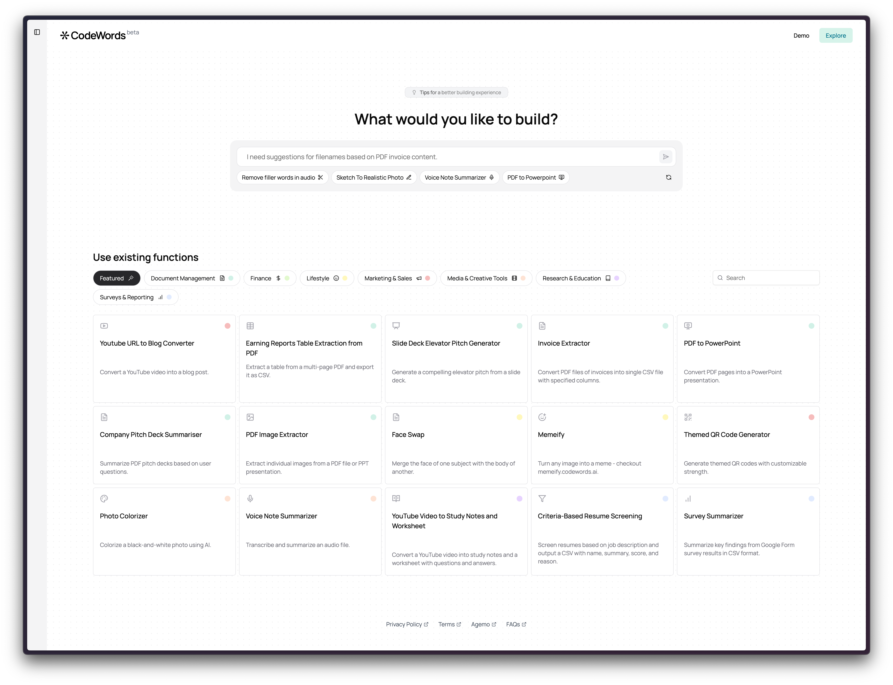

# Run

Each function created has its own Run page generated. Simply provide the input(s) and click “Run” to use your tool.

<figure><figcaption>
Run page of the "Video Labeling with Transcription and User Prompt Interaction” function
</figcaption></figure>

### Other Features in Run

<figure><figcaption>
“View Graph” shows you the architecture of your function
</figcaption></figure>

 

<figure><figcaption>
“API” gives you all information to integrate your function
</figcaption></figure>

 

<figure><figcaption>
Share your function 
</figcaption></figure>

<table><thead><tr><th width="200">Typ</th><th>Description</th><th>Example</th><th>What to do</th></tr></thead><tbody><tr><td>Missing integration packages</td><td>Occurs when CodeWords is missing a required integration.</td><td>Error: Unfortunately, the solution you require involves a specific set of libraries (midi2audio and music21) which are not listed among the allowed libraries and APIs available for use. However, I can suggest a workflow that you can implement if you have access to these necessary libraries.</td><td>Check out our available integrations <a href="https://agemo.notion.site/136c873bb9c7406d8ebf5ac8c4b5dcba?pvs=25#73b202bd047a41fd9cc45aad4ae803d1">here</a></td></tr><tr><td>Not possible to build</td><td>Happens when the desired tool is outside of the scope</td><td></td><td>Get in touch with us on <a href="https://discord.codewords.ai/">Discord</a> or check our Example Library</td></tr><tr><td>Description too vague</td><td>Happens when the initial prompt is too vague</td><td>Error: Currently, your problem description is too vague for me to design a concrete stateless workflow solution.</td><td>Check our templates or use the Check and Enhance feature.</td></tr></tbody></table>
