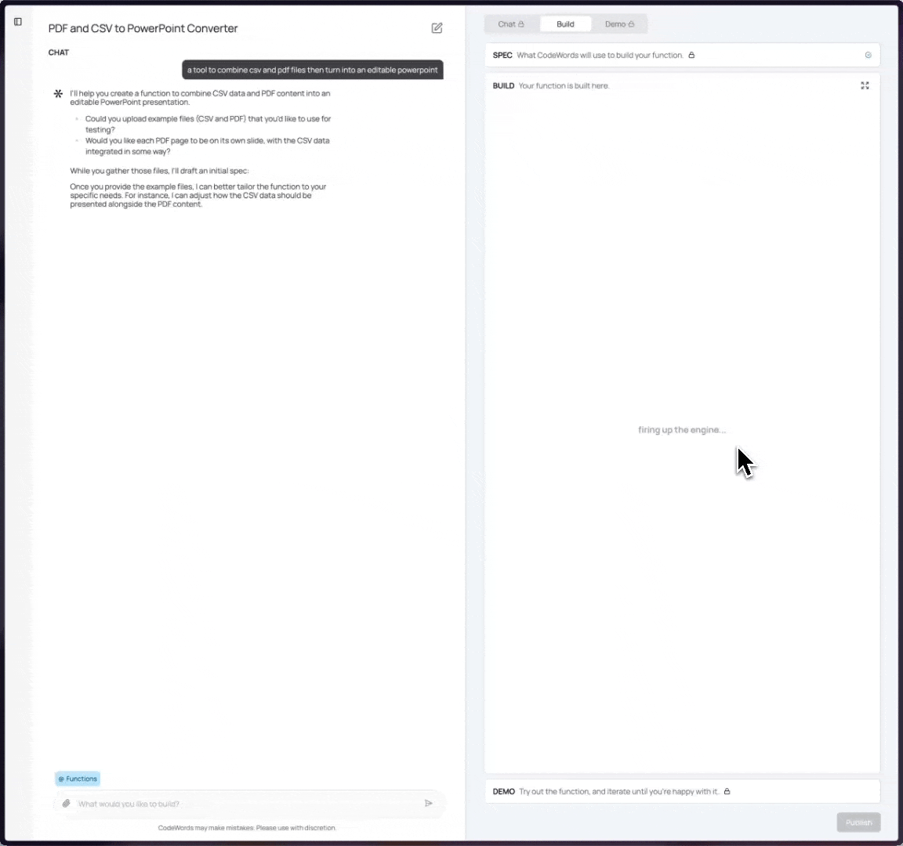

# Quick Start

All you need to get started with is an idea that you type in the prompt bar. Today, CodeWords is best for document processing, data extraction and manipulation use cases.&#x20;

Think of it as a team of engineers that will take your idea, form a project brief (the "Spec") and implement it in a few minutes.

**In need of inspiration?** Check existing functions in "Explore" or in the homepage gallery.

<figure><figcaption>
CodeWords homepage
</figcaption></figure>

> CodeWords is currently optimized for desktop use only.

## Start Building

Enter your idea in as many words as you like.

<figure><figcaption></figcaption></figure>

When you click enter, you land in **Wordshop, the all-in-one creation environment** where you can

* Craft your Spec, as if you were to build a projec brief
* Build and iterate on your CodeWords function
* Test it in Demo
* Publish your function

<figure><figcaption>
Wordshop
</figcaption></figure>

Use the "Chat" on the left to enter any requirements and build the Spec on the right. Think of the Spec as your project brief.&#x20;

Once the "Build" button appears, your function is ready to be generated.

<figure><figcaption></figcaption></figure>

## Demo your function

In less than the time it takes you to make a coffee, your function is built and ready to test in Demo.

<figure><figcaption></figcaption></figure>

Happy with your tool? Publish it to consume it as a workflow and share with your peers.

> **Need help building something?** [Book](https://calendar.app.google/ggmGV1buZZASGd9F9) a call with us or get in touch at [support@agemo.ai](mailto:support@agemo.ai) .

