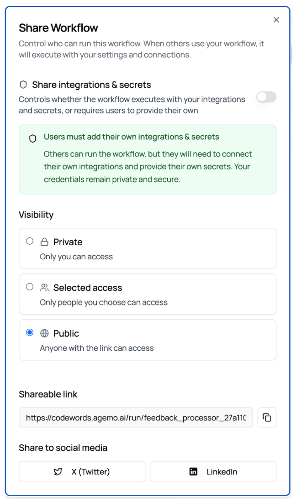

# How to submit a template \[NEEDS REVIEW]

Templates are pre-built automations. You can read more about how to use them here.

Our template gallery showcases CodeWords automations built by hundreds of people from around the world, and we’re always looking for new submissions! Learn what our template requirements are, and how to submit a template to us below. For any questions, reach out to [support@agemo.ai](mailto:support@agemo.ai)

### Template test requirements

#### Validation standards

1. Each workflow built from the chat must generate a [codewords.agemo.ai/run/](http://codewords.agemo.ai/run/)URL

<figure><figcaption></figcaption></figure>

2. Each workflow must follow the exact inputs and outputs outlined in the requirements

#### End-to-end user experience

1. Test the auto-generated UI ([codewords.agemo.ai/run/](http://codewords.agemo.ai/run/)) with real user inputs
2. Test with multiple input scenarios, including edge cases
3. Verify all field descriptions and examples are clear: report any anomaly
4. Ensure error messages are user-friendly: report any anomaly
5. Test the complete user workflow from input to output

#### Integration testing

1. Make sure all external service connections are working properly
2. If you don’t have access to a required API key (e.g. ZoomInfo, Attio, Hootsuite), contact us
3. Test limits of rate and timeout handling: add that in the report
4. Ensure all file uploads/downloads work correctly

### Submitting your template

Submit your workflow with this [workflow](https://codewords.agemo.ai/run/submit_template) with the service\_id, which can be found on the workflow URL: \*\*[https://codewords.agemo.ai/run/\[service\_id\]\*\*](https://codewords.agemo.ai/run/\[service_id]**)

**For each workflow built**, ensure the following:

**Link to workflow** (set your workflow to “Public” from the “Share” tab on the top right)

<figure><figcaption></figcaption></figure>

### Tips and tricks

#### Development efficiency

1. Open multiple chats to build in parallel

#### Integration best practices

1. Test External APIs First : Use the platform's testing tools to understand API responses before coding
2. Handle Failures Gracefully : External services can be unreliable - plan for failures
3. Use Structured Outputs : When working with LLMs, use Pydantic models for structured responses
4. Cache When Appropriate : Use Redis for temporary data storage between workflow runs
